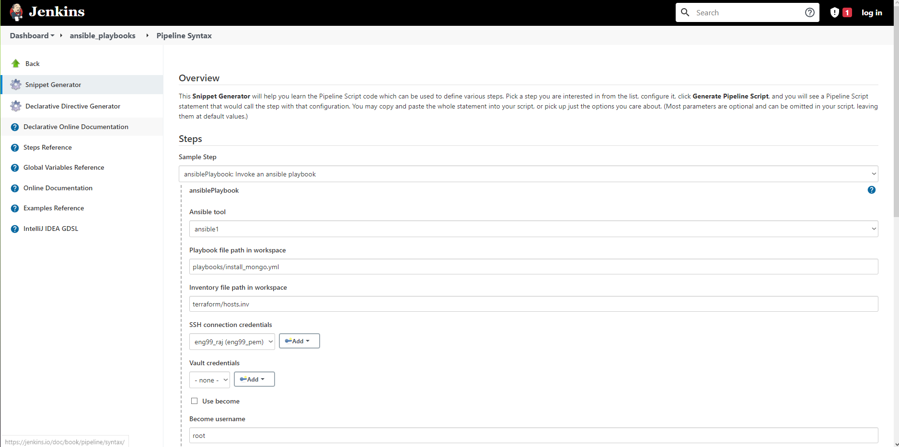
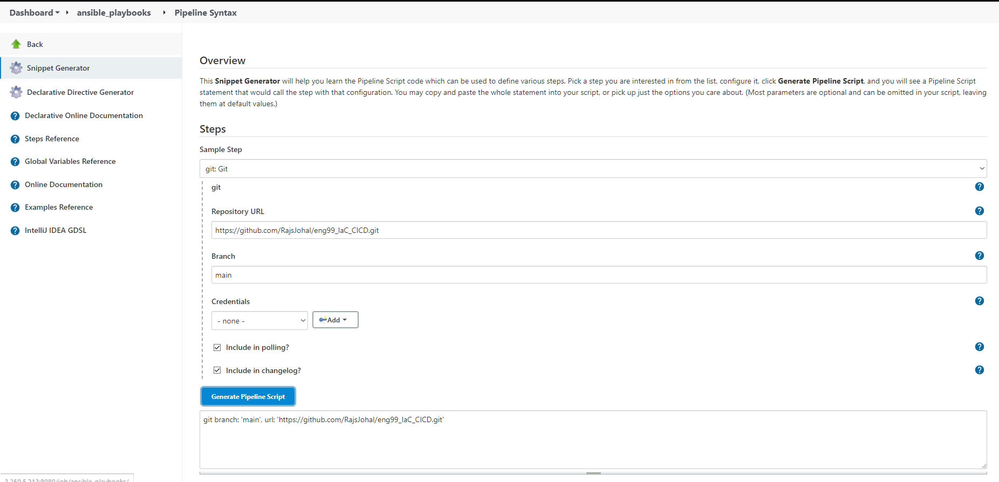

# Implementing IaC in Jenkins CICD Pipeline

## Terraform Implementation
- Set Up Jenkins server in EC2 instance - refer to jenkins cicd repo for guide. 
- Install plugins for Node, Git and Terraform
- Configure settings for Terraform
- Install CloudBees AWS Credentials plugin
- Attempted to create a pipeline job within jenkins to run my terraform main.tf file to create instances
- Issues with jenkins not being able to find my terraform plugin so had to manually dial into jenkins and install terraform and configure the path within the Global Tool Configuration. 
- Add AWS Credentials (access and secret keys) in manage jenkins, configuration and global propertie, you can set environment variables for the AWS keys. 
- added the following command to the terraform script:
```
output "app_instance_ip" {
  value = aws_instance.app_instance.public_ip
}

output "db_instance_ip" {
  value = aws_instance.db_instance.public_ip
}
```
- This prints the IP of app and db instance whenever terraform apply is run 

- Pipeline for terroform within jenkins
```
pipeline {
    agent any
    stages {
        stage('remove files') {
            steps {
                sh 'rm -rf eng99_IaC_CICD'
            }
        }
        stage('Checkout') {
            steps {
                sh 'git clone https://github.com/RajsJohal/eng99_IaC_CICD.git'
            }
        }
        stage('Apply Terraform'){
            steps {
                dir('eng99_IaC_CICD/terraform'){
                    sh 'terraform init'
                    sh 'terraform apply --auto-approve'
                    sh 'chmod +x ./hosts_config.sh'
                    sh './hosts_config.sh'
                }
            }
           
        }
    }
}
```
* The hosts_config.sh file contains the following code:
```
#!/bin/bash

echo -e "[app]\n$(terraform output app_instance_ip) ansible_user=ubuntu" | sed 's/"//g' > hosts.inv

echo -e "[db]\n$(terraform output db_instance_ip) ansible_user=ubuntu" | sed 's/"//g' >> hosts.inv
```
- Obtains the IP of both app and db ec2 instances and echoes into the hosts.inv to be used as a hosts file witin ansible in jenkins
- This code is added to a provisioning file and run within the pipeline job. 
- There is another metthod to create a hosts file by running a yml file which obtains the information about running instances refer [here for ansible inventory syntax](https://docs.ansible.com/ansible/latest/collections/amazon/aws/aws_ec2_inventory.html) and [here for a guide on ansible inventories](https://medium.com/geekculture/a-complete-overview-of-ansible-dynamic-inventory-a9ded104df4c)

## Ansible Integration
- Ansible Plugin, downloaded ansible and python on jenkins ec2 and added path to the binary folder where ansible lies. 
- Playbooks can be stored within jenkins, along with the vault and hosts file. 
- Jenkins server instance acts as a ansible controller
- hosts file must end with .inv and become a inventory file, path must be specified within jenkins. 

## Ansible Playbook in Jenkins
- Create a new pipeline job within Jenkins 
- Create a pipeline script and use the pipeline syntax to create a git command to copy the repo and a ansible playbook job to run the playbook within the ec2 instances
- Pipeline syntax code generator for ansible playbook and git:

 

- Pipeline script to run playbooks, code generated from pipeline syntax
```
pipeline {
    agent any
    stages{
        stage('execute playbooks'){
            steps {
                dir('../terraform_pipeline/eng99_IaC_CICD'){
                ansiblePlaybook credentialsId: 'eng99_raj_ssh', disableHostKeyChecking: true, installation: 'ansible1', inventory: 'terraform/hosts.inv', playbook: 'playbooks/install_mongo.yml'
                }
                
            }
            
        } 
        stage('execute app-setup playbook'){
            steps {
                dir('../terraform_pipeline/eng99_IaC_CICD'){
                ansiblePlaybook credentialsId: 'eng99_raj_ssh', disableHostKeyChecking: true, installation: 'ansible1', inventory: 'terraform/hosts.inv', playbook: 'playbooks/app_setup.yml'
                }
                
            }
            
        }
        stage('execute nginx playbook') {
            steps {
                dir('../terraform_pipeline/eng99_IaC_CICD'){
                ansiblePlaybook credentialsId: 'eng99_raj_ssh', disableHostKeyChecking: true, installation: 'ansible1', inventory: 'terraform/hosts.inv', playbook: 'playbooks/install_nginx.yml'
                }
                
            }
        }
        stage('execute app') {
            steps {
                dir('../terraform_pipeline/eng99_IaC_CICD'){
                ansiblePlaybook credentialsId: 'eng99_raj_ssh', disableHostKeyChecking: true, installation: 'ansible1', inventory: 'terraform/hosts.inv', playbook: 'playbooks/install_node.yml'
                }   
                
            }
        }
    }
}
```
- For each stage, specify the workspace where the terraform pipeline ran in order to acquire the hosts.inv file to be refernced when running the playbooks
